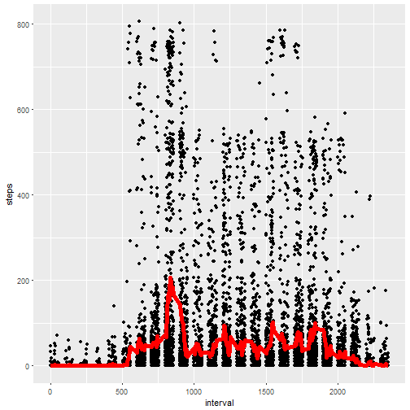
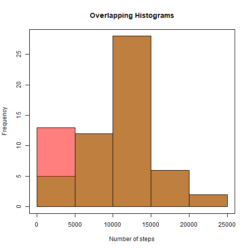

## Introduction

This document is the course 1 project to Reproducible Research module; it starts with data fetching from dataset called "Activity monitoring data" and sequent data representation and analysis based on the questions addressed in the "Review Criteria" document.

This file will be made available on GitHub repo at my personal page address: https://github.com/MarioPre.

## Data fetching

First of all, let's go to read data from dataset and store them into a data frame in R.


```r
dataframe<-read.csv("activity.csv", header=TRUE)
```

## Calculate the total number of steps taken per day

The variable steps4Day contains the total number of steps for each day of measurement and following there is the histogram representation related to the number of steps taken each day.


```r
steps4Day<-aggregate(steps~date, dataframe,sum,na.action = na.omit)
summary(steps4Day$steps)
```

```
##    Min. 1st Qu.  Median    Mean 3rd Qu.    Max. 
##      41    8841   10765   10766   13294   21194
```

```r
hist(steps4Day$steps, main = "Histogram of steps per day", xlab="Number of steps", border = "blue", col = "green",las=1)
```


It is clear, both from statistical summary and by the histogram, that the minimum steps taken per day is 41 and the maximum in 21194 and occurs less of 5 times. The mean and the median are the same at 10765 steps occurred more than 25 days during observation period.

As stated before the median and the mean are quite the same and are, respectively, 10,765 and 10,766 steps per day.

## Average daily activity pattern
Here is the the mean calculation per each interval per day, then plot the step average (line in bold red) per each 5 minutes interval and extract the maximum average steps per day


```r
dataframe_meanDAY<-aggregate(steps~interval, dataframe,mean)
ggplot(dataframe, aes(x=interval, y=steps)) + geom_point() + stat_summary(aes(y = steps,group=1), fun.y=mean, colour="red", geom="line",size=2,group=1)
```

```
## Warning: Removed 2304 rows containing non-finite values (stat_summary).
```

```
## Warning: Removed 2304 rows containing missing values (geom_point).
```



```r
dataframe_meanDAY[which.max(dataframe_meanDAY$steps),]
```

```
##     interval    steps
## 104      835 206.1698
```

## Imputing missing values

In the dataset there are a certain number of NA values which may introduce a bias into some calculations or summaies of the data.

The dataframe appears as following


```r
head(dataframe)
```

```
##   steps       date interval
## 1    NA 2012-10-01        0
## 2    NA 2012-10-01        5
## 3    NA 2012-10-01       10
## 4    NA 2012-10-01       15
## 5    NA 2012-10-01       20
## 6    NA 2012-10-01       25
```

# NA data evaluation

Now, a short evaluation of NA values and % over total valid data available.


```r
NAtotal<-sum(is.na(dataframe$steps))
validData<-sum(!is.na(dataframe$steps))
```

The total number of missing data and percentage of NA data over available data is


```r
NAtotal
```

```
## [1] 2304
```

```r
percent<-NAtotal/validData*100
percent
```

```
## [1] 15.09434
```

There is a total amount of 2304 missing data (NA) and its percentage is 15%, so we must consider a strategy in order to replase NAs limiting bias effects.

The  strategy addresses the comparison between original dataframe and dataframe modified using mean steps per 5 minutes interval to replace NA.


```r
mean_INT<-mean(aggregate(steps~date, dataframe,mean,na.action = na.omit)$steps)/2355
dataframe_INT<-replace(dataframe$steps,is.na(dataframe$steps),mean_INT)
dataframe_INT<-data.frame(dataframe_INT)
dataframe_INT<-cbind(dataframe_INT,dataframe$date,dataframe$interval)
colnames(dataframe_INT)<-c("steps","date","interval")
```

Now the comparison between the original dataset (total daily steps) and the one with NAs filled with daily 5 minutes interval mean (total daily steps):


```r
steps4Day_INT<-aggregate(steps~date, dataframe_INT,sum)
summary(steps4Day$steps)
```

```
##    Min. 1st Qu.  Median    Mean 3rd Qu.    Max. 
##      41    8841   10765   10766   13294   21194
```

```r
summary(steps4Day_INT$steps)
```

```
##      Min.   1st Qu.    Median      Mean   3rd Qu.      Max. 
##     4.572  6778.000 10395.000  9354.829 12811.000 21194.000
```

then the histogram of the filled dataset


```r
hist(steps4Day_INT$steps, main = "Histogram of steps per day", xlab="Number of steps", border = "blue", col = "red",las=1)
```


Now we can overlap two histograms in order to understand where we introduce a major bias in the data:


```r
hist(steps4Day$steps, col=rgb(0,1,0,0.5), main = "Overlapping Histograms", xlab= "Number of steps")
hist(steps4Day_INT$steps, col=rgb(1,0,0,0.5), add=T)
box()
```



Considering the figures in the statistical summary and the pictorial histograms superposition representation we can assert that the replacement of NAs with the daily average 5 min interval introduces a modification in the lower tail of the distribution related to an increase of less than 5000 steps per day for a factor 3.
The other sets of average/day steps remain the same as confirmed by the brown color given by the superposition of green and red.

## Differencies in activity patterns between weekdays and weekends

In this section we are going to investigate whether or not differencies in the steps during weekend and weekdays exists.

First of all we must make a discrimination between weekdays and weekends adding a variable (weekday_weekend) to the datset (dataframe)


```r
weekdaysDF<-c("lunedì", "martedì", "mercoledì", "giovedì", "venerdì")
dataframe$date<-as.Date(dataframe$date)
dataframe$W_NW_days<- c('weekend', 'weekday')[(weekdays(dataframe$date) %in% weekdaysDF)+1L]
```

Then the pictorial representation of "Steps per weekdays vs weekends"


```r
dataframe_W_NW_DAY<-aggregate(steps~interval + W_NW_days, dataframe,mean)
dataframe_W_NW_DAY$W_NW_days<-as.factor(dataframe_W_NW_DAY$W_NW_days)
colnames(dataframe_W_NW_DAY)[2]<-"weekday_weekend"
ggplot(dataframe_W_NW_DAY, aes(x=interval, y=steps, colour=weekday_weekend, group=weekday_weekend)) + geom_line(size=2) + facet_grid(weekday_weekend ~ .)+ggtitle("Steps per weekdays vs weekend averaged per 5 min interval")+ labs (x="Interval",y="Avg 5 min interval Daily Steps")
```


This conclude our evaluations on dataset provided.
